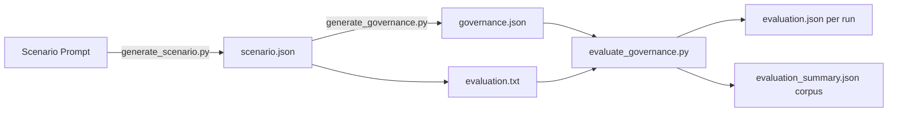

<div align="center">

# 🛰️ MI9 -- Agent Intelligence Protocol: Runtime Governance for Agentic AI Systems

[](https://arxiv.org/abs/2508.03858)
[](#requirements)
[](./LICENSE)
[](#testing--ci)
[](#reproducibility)
[](../../issues)
[](../../discussions)

**MI9** is a modular framework for **synthetic scenario generation**, **runtime governance**, and **LLM-judged evaluation** of agentic AI systems.

**Paper:** _MI9 - Agent Intelligence Protocol: Runtime Governance for Agentic AI Systems_ — **[arXiv:2508.03858](https://arxiv.org/abs/2508.03858)**

</div>

---

## ✨ Highlights

- **Full pipeline**: _Scenario ➜ Governance ➜ Evaluation_ (scripts + prompts)
- **Structured outputs**: Per-run `evaluation.json` and corpus-level `evaluation_summary.json`
- **LLM-as-judge** with **configurable rubrics** and strict JSON contracts
- **Concurrent, fast** batch processing (multithreaded / asyncio where appropriate)
- **Reproducible** via seeds, prompt freezes, and model version pins
- **Paper-ready tables/figures** derivable directly from `evaluation_summary.json`

---

## 🗺️ Table of Contents

- [Overview](#overview)
- [Requirements](#requirements)
- [Installation](#installation)
- [Quick Start](#quick-start)
- [Pipeline](#pipeline)
- [Usage](#usage)
- [Metrics](#metrics)
- [Outputs & Schemas](#outputs--schemas)
- [Reproducibility](#reproducibility)
- [Project Structure](#project-structure)
- [Configuration](#configuration)
- [Testing & CI](#testing--ci)
- [Roadmap](#roadmap)
- [Citation](#citation)
- [License](#license)
- [Acknowledgments](#acknowledgments)

---

## 🔎 Overview

MI9 operationalizes **agentic AI governance** as an end-to-end, repeatable workflow:

1. **Generate Scenarios** — Create diverse, realistic agent tasks across domains.
2. **Generate Governance** — Apply a governance model to produce traces & multi-system logs.
3. **Evaluate Governance** — Use an LLM judge to score compliance, risk discovery, and trace quality.

> 📄 _Read the paper_: **[arXiv:2508.03858](https://arxiv.org/abs/2508.03858)**

---

## 💻 Requirements

- **OS**: macOS / Linux / Windows
- **Python**: **3.10+**
- **API**: Google Generative AI (Gemini) key in `GOOGLE_API_KEY`
- **Pip**: `pip>=22`

---

## ⚙️ Installation

```bash
git clone https://github.com/ORG/REPO.git
cd REPO

# (Optional) create a virtual environment
python -m venv .venv && source .venv/bin/activate  # Windows: .venv\Scripts\activate

# Install dependencies
pip install -r requirements.txt
# or minimal:
pip install google-generativeai
```

Set your key:

```bash
export GOOGLE_API_KEY='your-api-key-here'     # macOS/Linux
# PowerShell (Windows):
# $env:GOOGLE_API_KEY = "your-api-key-here"
```

---

## 🚀 Quick Start

```bash
# 1) Generate scenarios
python src/generate_scenario.py \
  --output-dir data/ \
  --count 5 \
  --classes 'Autonomous Vehicle Navigation' 'Medical Diagnosis Assistant' \
  --num-workers 8

# 2) Generate governance traces
python src/generate_governance.py data/ --concurrency 10

# 3) Evaluate governance (LLM-as-judge)
python src/evaluate_governance.py \
  --input-dir data/ \
  --num-workers 8 \
  --model gemini-1.5-flash-latest \
  --evaluation-prompt prompts/evaluation.txt
```

**Outputs**

* Per-run: `data/<RUN_ID>/evaluation.json`
* Summary: `data/evaluation_summary.json`

---

## 🔧 Pipeline



---

## 🧰 Usage

### 1) Scenario Generation

```bash
python src/generate_scenario.py \
  --output-dir data/ \
  --count 5 \
  --classes 'Autonomous Vehicle Navigation' 'Medical Diagnosis Assistant' \
  --num-workers 8 \
  --model gemini-1.5-flash-latest \
  --api-key $GOOGLE_API_KEY \
  --scenario-prompt prompts/scenario_prompt.txt
```

### 2) Governance Generation

```bash
python src/generate_governance.py data/ \
  --concurrency 10 \
  --model gemini-1.5-flash-latest \
  --api-key $GOOGLE_API_KEY \
  --governance-prompt prompts/governance_prompt.txt \
  --overwrite   # optional
```

### 3) Governance Evaluation

```bash
python src/evaluate_governance.py \
  --input-dir data/ \
  --num-workers 8 \
  --model gemini-1.5-flash-latest \
  --api-key $GOOGLE_API_KEY \
  --evaluation-prompt prompts/evaluation.txt \
  --overwrite   # optional
```

---

## 📏 Metrics

*Default rubric (customizable via `prompts/evaluation.txt`):*

### Policy Compliance
- `compliance_score` (0–1)
- `violations[]` with grounded evidence

### Risk Discovery & Mitigation
- `risk_identification_recall` (0–1)
- `mitigation_quality` (0–1)
- `emergent_risk_tags[]` (safety, security, privacy, legal, reputational, …)

### Trace Quality
- `coherence` (0–1)
- `grounding` (0–1)
- `action_validity` (0–1)

### Operational (if available)
- `latency_ms`, `token_cost_estimate`
- `judge_notes`

> If your scenarios include **gold labels**, plug in a post-processor to compute **precision / recall / F1** for risk/violation detection.

---

## 📦 Outputs & Schemas

### Per-run — `evaluation.json`

```json
{
  "run_id": "1",
  "model": "gemini-1.5-flash-latest",
  "metrics": {
    "compliance_score": 0.88,
    "risk_identification_recall": 0.67,
    "mitigation_quality": 0.74,
    "coherence": 0.91,
    "grounding": 0.85,
    "action_validity": 0.90
  },
  "violations": [
    {"policy": "Privacy", "severity": "medium", "evidence": "Excerpt or span reference"}
  ],
  "emergent_risk_tags": ["safety", "privacy"],
  "operational": {"latency_ms": 1240, "token_cost_estimate": 0.0031},
  "judge_notes": "Concise rationale with references to scenario/log lines."
}
```

### Corpus — `evaluation_summary.json`

```json
{
  "total_runs": 50,
  "by_class": {
    "Autonomous Vehicle Navigation": 20,
    "Medical Diagnosis Assistant": 30
  },
  "macro_avgs": {
    "compliance_score": 0.81,
    "risk_identification_recall": 0.62,
    "mitigation_quality": 0.70,
    "coherence": 0.88,
    "grounding": 0.84,
    "action_validity": 0.87
  },
  "emergent_risk_counts": {
    "safety": 19,
    "security": 11,
    "privacy": 14,
    "legal": 9,
    "reputational": 8
  }
}
```

---

## 🔐 Reproducibility

- **Seeds**: Deterministic random seeds for any sampling.
- **Model Pins**: Always specify `--model` and prefer explicit version tags.
- **Prompt Freezes**: Commit `prompts/*.txt` with versioned filenames for each study.
- **Concurrency**: `--num-workers` affects throughput, not scores.
- **Audit Trails**: Use `--verbose` to log prompts, responses, and parse events.

---

## 🗂️ Project Structure

```
.
├── data/
│   ├── 1/
│   │   ├── scenario.json
│   │   ├── governance.json
│   │   └── evaluation.json
│   └── evaluation_summary.json
├── prompts/
│   ├── scenario_prompt.txt
│   ├── governance_prompt.txt
│   └── evaluation.txt
├── src/
│   ├── generate_scenario.py
│   ├── generate_governance.py
│   └── evaluate_governance.py
├── requirements.txt
├── LICENSE
└── README.md
```

---

## ⚙️ Configuration

All core behavior is controlled via CLI flags and prompt templates:

- **Prompts**: Edit `prompts/evaluation.txt` to change rubric dimensions and **strict JSON output keys**.
- **Hooks**: Add post-processing in `src/evaluate_governance.py` to compute extra metrics (e.g., bootstrap CIs, PR curves).
- **Filtering**: Point `--input-dir` to specific runs or pass multiple run paths.

---

## ✅ Testing & CI

- **Unit tests** (suggested): prompt parsing, JSON validation, and aggregation logic.
- **Smoke tests**: single-sample end-to-end run.
- **CI**: add a workflow to lint (`ruff`/`flake8`), test (`pytest`), and validate JSON schemas.

---

## 🧭 Roadmap

- [ ] Gold-label alignment for select domains (auto PR curves)
- [ ] Additional judge ensembles & adjudication strategies
- [ ] Pluggable risk taxonomies (sector-specific)
- [ ] Cost & latency dashboards
- [ ] Exporters: CSV/LaTeX for paper appendices

---

## 📚 Citation

If you use MI9 or the evaluation suite, please cite:

```bibtex
@misc{mi9_2508_03858,
  title  = {MI9: Agentic AI Governance Framework \& Synthetic Evaluation},
  year   = {2025},
  eprint = {2508.03858},
  archivePrefix = {arXiv},
  primaryClass  = {cs.AI},
  url    = {https://arxiv.org/abs/2508.03858}
}
```

---

## 📜 License

Released under **MIT** (see [`LICENSE`](./LICENSE)).

*Update the badge at the top if you choose Apache-2.0 or another license.*

---

## 🙏 Acknowledgments

Thanks to the contributors and reviewers who shaped the MI9 evaluation rubric and reference implementation.

Contributions welcome—please open an **Issue** or start a **Discussion** to propose metrics, gold labels, or domain packs.

---

> 💡 **Tip:** To produce camera-ready tables, consume `data/evaluation_summary.json` directly in your plotting/table scripts and pin the prompt version + model tag in your appendix.
